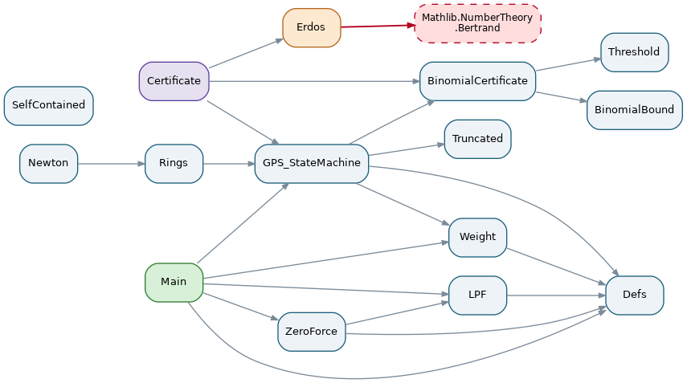

# StructuralBertrand — Lean 4 formalization

Machine-checked formalization accompanying the paper
**"A Structural Sieve for Bertrand's Postulate: The Deterministic Reach of the
Prime Base and its Newton Closure"** (A. Flamandzki).

**Status: fully verified — zero `sorry`, no extra axioms beyond Mathlib.**
The entire chain, from the definition of the complete generative base (Def. 2.1)
to `bertrand_chebyshev`, is machine-checked. The main theorem does **not** use
Mathlib's proof of Bertrand's postulate (`Nat.bertrand` /
`Nat.exists_prime_lt_and_le_two_mul`), and its import closure does **not** contain
`Mathlib.NumberTheory.Bertrand` at all: the quantitative atom is closed by a
self-contained binomial certificate (`binomial_contradiction`). See
*Non-circularity* below.

## Origin of the result

The starting observation is **not** Bertrand's. Bertrand (1845) conjectured, from
tables, that every window `(n, 2n]` contains a prime. This project starts from a
different, structural observation, and it involves **two distinct determinisms**
that must not be conflated. **Base determinism (self-containment): the base
`𝒫 = {2, …, P_max}` builds every composite exactly up to `2·P_max`** — inside
`(P_max, 2·P_max]` every composite is fully built from the base (all its prime
factors lie in the base: `window_composite_smooth`), so an uncovered position can
only be a new prime. Just beyond `2·P_max` self-containment breaks: the first
composite requiring a prime *outside* the base appears (`2·nextprime(P_max)`), so a
new prime becomes **necessary** — this is how far the base generates the integers
on its own. Distinct from it, **generative determinism (the sieve's decision,
uncovered ⟺ prime) reaches further**, throughout the deterministic zone
`(P_max, P_max²)` (`void_iff_prime_in_deterministic_zone`), and breaks only at the
square of the anchor (`determinism_breaks_above` exhibits the composite void `q²`).
The window and its width are therefore not an assumption borrowed from Bertrand's
statement — they are *derived* as the maximal self-contained territory of the base
(`SelfContained.lean`, `window_self_contained`). The object is thus a
single locked triple **(base, window, width)** in which `P_max` is at once the
largest element of the base, the start of the window, and the window's width; the
base is the complete run of consecutive primes up to `P_max` (no prime missing),
and base and window co-scale with `P_max` rather than being independent parameters.

From this single boundary the whole postulate is reduced to one localized
quantitative atom: *the sieve of the base never covers its own window completely*.
The governing quantity of the object is the **local insufficiency of the full base**
over its own window `(P_max, 2P_max]` — the longest run of covered positions there;
external gap functions (below) only upper-bound it.

## What is proved, and by what means

The reduction chain (all sorry-free):

```
bertrand_chebyshev  ←  prime_in_window  ←  structural_sieve_survivor
                     ←  dense_sieve_survivor  ←  binomial_contradiction
```

### Module dependency graph



The graph (regenerate with `scripts/dependency_graph.py`, which also prints a
non-circularity audit) makes the import structure explicit. `Main` reaches the
quantitative kernel through `GPS_StateMachine → BinomialCertificate →
{BinomialBound, Threshold}` — the self-contained path. The only edge to
`Mathlib.NumberTheory.Bertrand` (red) comes from `Erdos.lean`, which is reachable
only from `Certificate.lean` (the modularity interface) and is **not** in the import
closure of `Main`. So the main theorem does not depend on Mathlib's Bertrand theorem.

Three layers, with distinct provenance:

**1. The structural reduction (independent, this project).**
LPF bound, Zero Effective Force, structural weight `w ≥ 1`, self-containment
(*why `2·P_max`*), the sparse regime closed unconditionally by a union bound
(`Truncated.lean`), the small anchors `P_k ≤ 83` closed by a sufficient coprimality
condition on the *active-covering primes* (`p² ≤ 2P_k`) via `g(30)=6`, `g(210)=10`,
`g(2310)=14` (`Rings.lean`) — a loose external upper bound from a smaller modulus,
**not** the object's own gap; the deterministic zone `(P_k, P_k²)`; and the disjoint
minFac-fiber telescope. No structural closure of the existence atom in the general
window was found; the atom is closed on the central binomial coefficient below.

(On the Jacobsthal regimes: `g(M)` is the global gap of a *fixed* modulus `M`, and
here `M` is the product of the active-covering primes `p² ≤ 2P_k` — a subset that
coincides with a smaller, foreign object, not the full base. It is not the
object's own quantity; `g(M) ≤ P_k` is only a sufficient upper proxy that happens
to close the small anchors.)

**2. The central binomial coefficient (structural, this system).**
The quantitative atom is closed on the central binomial coefficient `C(2n,n)`:
`4^n = (1+1)^{2n}` is the sum of the `2n+1` binomial coefficients of order `2n`. Its
prime factorization in the window is governed by the paper's S1 purity law: a new
source `q ∈ (n, 2n]` divides `C(2n,n)` exactly once, because its first multiple `2q`
exceeds `2n`. Formally: `window_primes_prod_dvd_centralBinom`
(Rings.lean/Newton.lean). The coefficient is used **structurally**: its prime
factorization records the window's content, and the object is reached from the S1
purity law, not taken from prior work. Erdős reached the same object in 1932 by a
different route; this is a convergence on one mathematical object, and prior use
carries no exclusivity over it. The lower bound `4^n ≤ (2n+1)·C(2n,n)` is proved from
scratch from the Pascal row (`four_pow_le_newton`, Newton.lean).

**3. The quantitative certificate (self-contained, this project).**
For `n ≥ 512` the two bounds on `C(2n,n)` are combined. The upper bound
(`window_centralBinom_le`, `BinomialBound.lean`) — if the window is empty, every
prime factor of `C(2n,n)` is `≤ 2n/3`, so the product is at most
`(2n)^√(2n) · 4^(2n/3)` — is reproved in-project from Legendre/Kummer and primorial
primitives, importing only `Choose.Factorization` and `Primorial`, **not**
`Mathlib.NumberTheory.Bertrand`. The prime-free size threshold
`n · (2n)^√(2n) · 4^(2n/3) ≤ 4^n` (`threshold_inequality`, `Threshold.lean`) is a
generic convexity inequality, adapted from Mathlib's analysis (not its Bertrand
file). With the lower bound `4^n < n · C(2n,n)` (`Nat.four_pow_lt_mul_centralBinom`)
they give `4^n < 4^n`, a contradiction (`binomial_contradiction`,
`BinomialCertificate.lean`). Small windows `2 < n < 512` are closed by a local
computational oracle (`small_window_oracle`, `native_decide`).

**Provenance statement (for referees).** The development is neither "independent
of Erdős" nor "Erdős in disguise". An independent structural reduction shows
*why* the postulate collapses to a single atom and closes entire regimes without
any counting; the atom is then closed on the central binomial coefficient `C(2n,n)`,
whose prime factorization records the window's content via the S1 purity law, reached
from this construction and not taken from prior work. The two bounds on `C(2n,n)` are
reproved in-project (`BinomialBound.lean`, `Threshold.lean`), so the closing
certificate imports no Mathlib Bertrand theorem. Erdős reached the same object in
1932 by a different path: a convergence on one object, with historical priority of
use but no exclusivity over it. Modularity is a theorem (`Certificate.lean`,
`WindowCertificate`): the atom's closure depends only on an abstract certificate,
and two instances plug into the identical slot — `erdos_certificate` (via Mathlib's
inequalities) and the self-contained `binomial_certificate`. Any certificate of the
same strength (a Chebyshev-type estimate; or, on the active-covering modulus, a
bound `g(∏_{p²≤2P_k} p) ≤ P_k` of Iwaniec strength) closes the atom without touching
anything above it.

## Non-circularity

The main theorem `bertrand_chebyshev` closes the atom via the self-contained
`binomial_contradiction`; its import closure does **not** contain
`Mathlib.NumberTheory.Bertrand`. That file is imported only in `Erdos.lean`, which
supplies instance A (`erdos_certificate`) for the modularity comparison and sits
**off** the main path. The circularity audit is a grep over **usages**, not imports:

```sh
grep -rn "sorry" StructuralBertrand                      # no matches
grep -rn "Nat.bertrand[^_]\|exists_prime_lt" StructuralBertrand
# matches only in comments/documentation; never applied in a proof
```

## Trust base

Beyond the Lean kernel and Mathlib, several finite facts are discharged with
`native_decide` (compiled evaluation): the small-window oracles for `n < 512`
(`small_window_oracle`; and the parallel `small_window_prime` in `Erdos.lean`) and
`jacobsthal_2310`. `native_decide` extends
the trusted base from the Lean kernel to the Lean compiler; auditors who reject
it can re-verify those finite statements by any external computation — each is a
bounded, explicitly decidable check.

## Exact versions (required for reproduction)

| Component | Pin |
|---|---|
| Lean toolchain | `leanprover/lean4:v4.14.0` (file `lean-toolchain`) |
| Mathlib | tag `v4.14.0`, commit `4bbdccd9c5f862bf90ff12f0a9e2c8be032b9a84` |

Transitive dependencies (from `lake-manifest.json`, manifest format `1.1.0`):

| Package | Commit |
|---|---|
| batteries | `8d6c853f11a5172efa0e96b9f2be1a83d861cdd9` |
| aesop | `5a0ec8588855265ade536f35bcdcf0fb24fd6030` |
| proofwidgets | `68280daef58803f68368eb2e53046dabcd270c9d` |
| Qq | `303b23fbcea94ac4f96e590c1cad6618fd4f5f41` |
| importGraph | `519e509a28864af5bed98033dd33b95cf08e9aa7` |
| LeanSearchClient | `d7caecce0d0f003fd5e9cce9a61f1dd6ba83142b` |
| plausible | `42dc02bdbc5d0c2f395718462a76c3d87318f7fa` |
| Cli | `726b3c9ad13acca724d4651f14afc4804a7b0e4d` |

The pinned commits are recorded in `lake-manifest.json`; keep that file under
version control so the exact dependency graph is reproducible.

## Build

The toolchain is selected automatically by `elan` from `lean-toolchain`.

```sh
lake exe cache get      # download prebuilt Mathlib oleans for the pinned commit
lake build              # build the StructuralBertrand library
```

`lake exe cache get` is essential: without it, `lake build` would attempt to
compile all of Mathlib from source. A successful `lake build` reports **no
errors, no `sorry`, and no warnings in project files** (doc-string lint notices
replayed from Mathlib's own files are expected and harmless).

## File map

| File | Content (paper reference) |
|---|---|
| `StructuralBertrand/Defs.lean` | Complete generative prime base, sieve coverage, window (Def. 2.1, Prop. 2.2) |
| `StructuralBertrand/LPF.lean` | Least Prime Factor bound; uncovered ⇒ prime (Lemma 3.1, Cor. 3.2) |
| `StructuralBertrand/ZeroForce.lean` | Zero Effective Force; composites covered by preceding base (Lemma 4.1, Cor. 4.2) |
| `StructuralBertrand/Weight.lean` | Structural weight `w ≥ 1`; expansion capacity `M' < P·φ(M')` (Lemma 4.3, Cor. 4.5) |
| `StructuralBertrand/SelfContained.lean` | Self-containment fixes the window width (*why `2` / why `P_min`*) |
| `StructuralBertrand/Truncated.lean` | Sparse-regime positivity by union bound, unconditional |
| `StructuralBertrand/Rings.lean` | Ring collective: void/coverage dichotomy, determinism boundary, small-anchor closures `P_k ≤ 83` (sufficient gap bound on the active-covering rings), minFac telescope, interference (Legendre) identity, S1 bridge to `C(2n,n)`, generalized family `(P_max, P_min·P_max]` |
| `StructuralBertrand/Newton.lean` | The central binomial coefficient and the window's prime content: S1 divisibility, lower bound `4^n ≤ (2n+1)·C(2n,n)` from the Pascal row, empty window ⇒ old sources only |
| `StructuralBertrand/BinomialBound.lean` | Upper bound `window_centralBinom_le`, reproved from Legendre/Kummer + primorial primitives (no Bertrand import) |
| `StructuralBertrand/Threshold.lean` | Prime-free size inequality `threshold_inequality` (real convexity; adapted from Mathlib's analysis, not its Bertrand file) |
| `StructuralBertrand/BinomialCertificate.lean` | **Self-contained kernel**: `binomial_contradiction` — two bounds on `C(2n,n)` + local `native_decide` oracle; imports no `Mathlib.NumberTheory.Bertrand` |
| `StructuralBertrand/GPS_StateMachine.lean` | Generative window; regime dispatch; `dense_sieve_survivor` (routes to `binomial_contradiction`); `prime_in_window` |
| `StructuralBertrand/Certificate.lean` | Modular interface `WindowCertificate`; instances `erdos_certificate` (via Mathlib) and `binomial_certificate` (self-contained) |
| `StructuralBertrand/Erdos.lean` | Instance A (off the main path): `erdos_contradiction` via Mathlib's two `C(2n,n)` inequalities — kept only for the modularity comparison |
| `StructuralBertrand/Main.lean` | Theorem 5.1 and `bertrand_chebyshev` |

## License

This subproject is licensed under the **Apache License, Version 2.0** — see
[`LICENSE`](LICENSE). This overrides the repository-root license for this directory: the
project depends on and adapts Mathlib (Apache-2.0), so its licensing must be
Apache-2.0-compatible. In particular `StructuralBertrand/Threshold.lean` adapts a prime-free
size inequality from Mathlib (authors Patrick Stevens and Bolton Bailey); the attribution is
recorded in [`NOTICE`](NOTICE). All other files are original to this development and depend on
Mathlib only as a library.

## Citation

Cite the accompanying paper (see [`CITATION.cff`](CITATION.cff)). The formalization makes
the logical status of the result unambiguous: the structural reduction is machine-verified
and independent; the quantitative kernel is closed by a self-contained argument on the
central binomial coefficient (`binomial_contradiction`), and modularity is a theorem — the
closure depends only on an abstract `WindowCertificate`, with a Mathlib-based and a
self-contained instance plugging into the same slot.
